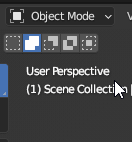
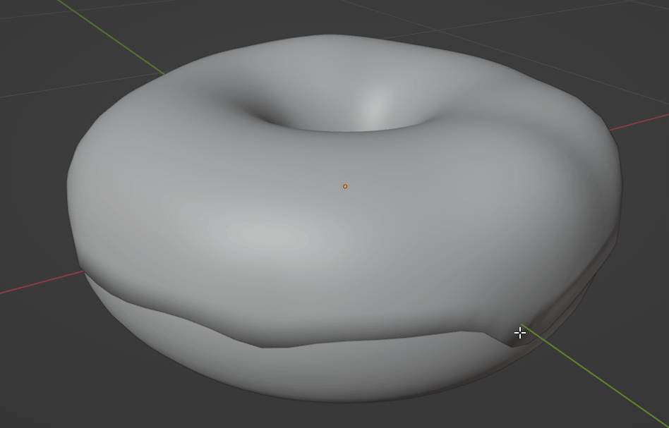
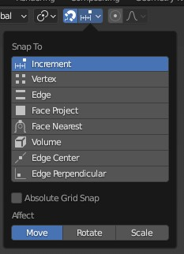
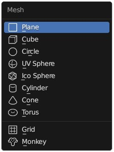

# Hotkeys

```{note}
:class: warning
[X, Y, Z] means choose 'X' or 'Y' or 'Z' on the keyboard.  
The '+' sign implies a combination of mouse clicks and button presses.   
LMB =  Left Mouse Button.   
RMB =  Right Mouse Button.  
MMB =  Middle Mouse Button. 
```    

| Command | Hot Key     | note |
| ------- | ------------|-----|
| Toggle Mode [**Edit**, **Object**] | Tab | **Object** mode is for selecting / effecting whole objects |
|  |  | **Edit** mode for working with parts of an object |
|  |  |  |


```{admonition} Warning
:class: warning

Some commands only work in **Object** Mode or in **Edit** Mode.  
Edit mode is only available when an object is selected.

``` 

| Command |  Blender      | Omniverse |  note        |
| ------- | -----------   | ------- | -----------|
|**Object**| _Key_ | |
| Move    | G             | W       |            |
| "       | G + MMB + Axis|         |            |
| "       | G + [X, Y, Z] |         |            |
| notes:  | Cursor can be anywhere| |            |
|         | LMB = Confirm, RMB = cancel |   |    | 
| Move + Axis Snap  | Click + Hold + MMB |  |    |
|Rotate   | R       |                    |       |
|         | R + [X, Y, Z]| E             |       |
| Scale   | S       | R                  |       |
|         | S + [X, Y, Z]|               |       |
| Clear Location | Alt + G| | |
| Duplicate | Shift + D | Ctrl + D | |
| Recover Operator Presets| F9 |||
| Rename File | F2 |||
| Hide / Unhide | H, Alt H - unhides all |  ||
||||


| Command |  Blender      | Note |        |
| ------- | -----------   | ------- | -----------|
|**Viewport**| **Blender** |      |  |
| Orbit  | Hold MMB + Drag | Alt + LMB |         |
| Pan    | Shift + MMB + Drag | Alt + MMB + Drag |  |
| Zoom   | MMB + Scroll       | MMB + Scroll |   |
| Zoom Smooth | Ctrl + MMB + Drag | |            |
| Focus Selected (Object) | Numpad period . | F |         |
|Look Thru Camera | Numpad - 0 |||
| Wireframe | Shift + Z| ???? |
| X Ray | Alt + Z | BLANK |
|||||
|||||
|**Align To View**||||
| Front View | NumPad - 1| | |
| Side View | Numpad - 3| |  |
| Top View| Numpad - 7 |  |  |
| Orthographic   | Numpad - 5 (on | off) |||
|||||
| **Selection** ||||
| Separate | P [ Selection, Material, Loose Parts ] || |
| Select Linked |  L, Ctrl + L  | ||
|||||


% If combined with the graph above, the image shrinks by almost half.
|**Snapping**||| |
|------------|---|---|---|
| Incremental (temporary) | Ctrl | | |
| Toggle Snapping | Shift + Tab | ||

---


| Blender |     Hot Key     |  notes    |
| ------- | -----------     | -------   |
|  | Object Mode | Edit Mode |          | 
| Delete | [ X , Delete ] | X , Delete + Select Type |
||||
||||

|**Edit**| Hot Key | notes |
|---|---|---|
| Delete | X | blank |
| Proportional Grab | O + G + Click [Vertice, Edge, Face ] + MMB - Scroll Up |[Video (Tutorial 2)](DonutTutorial.md#proportional-editing) |
|Scale Along Normals | Alt + S | [Video (Tutorial 2)](DonutTutorial.md#scale-along-normals) |  

---

#### Pop Up Menus

|Hot Key| Pop Up Menu|
|-------|------------|
|       | Add Object |
|**Shift + A**||
|       | Apply Scale|
|**Ctrl + A**|    |
|       | Change Shading on **Selected Object** |
|**RMB over background**||
|||
| Edit Mode| |
| Delete, X  |   |
|||

---

#### Pie Menus

| Hot Key | Pie Menu |
| ------ | -------- |
| <td style="text-align: center">Select **View** </td> | | 
| ~ (tilde) |   |
| <td style="text-align: center">Select **Mode** with **Object Selected**</td> | | 
|  Ctrl + Tab |     |      

---

#### Camera Hot Keys
| Command | Hotkey     | note |
| ------- | ---------- |----  |
| Move Camera to Perspective View  | Ctrl + Alt + Numpad - 0 | **Vital Hot Key** |

```{admonition} Warning
:class: warning

The Camera cannot be selected in **Edit Mode**

```

Edit > Preferences > Input > Emulate Numpad  
Allows the number keys on the top to switch views.  

---

#### Split Screen

| Command | Combination     | note |
| ------- | ------------|-----|
| Split Screen | Rollover + RMB | RMB over a pane, or use cross-hair and drag from upper left corner |

<style>
  video {
    width: 100%;
  }
</style>
 
<video controls>
<source src='https://www.dropbox.com/s/w5e5fbbkqu7v63d/Hot-Key_Split-Screen.mp4?raw=1'>
</video>

---

### Modifiers

| Modifier | note |
| -------  | -----|
| Solidify | Thicken, Offset should be positive |


---
