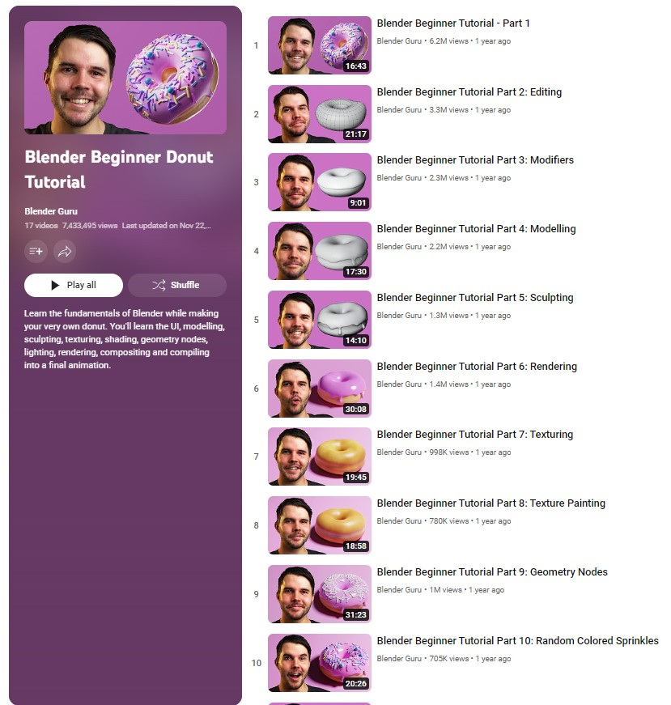

(resources)=

[Blender Beginner Donut Tutorial](https://www.youtube.com/playlist?list=PLjEaoINr3zgFX8ZsChQVQsuDSjEqdWMAD)

:::{card} 
As rendered using the browser Brave.

:::

[The Right way to Cut a Hole - Josh Gambrell](https://www.youtube.com/watch?v=Ci1jBOm_5NY)

% This is a comment. Below we have an 'Horizontal Rule', a line that goes across the page.
---

 

